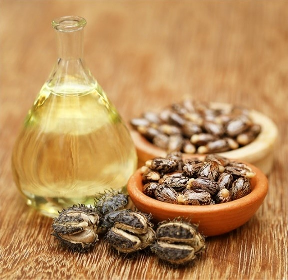

# I. INTRODUCCIÓN

::: {style="font-family:'Times New Roman', serif; font-size:16px; text-align:justify; line-height:1.75;"}

Ricinus communis L., conocida comúnmente como higuerilla o ricino, es una planta arbustiva perteneciente a la familia Euphorbiaceae, originaria de África tropical que actualmente se encuentra naturalizada en regiones tropicales y subtropicales de todo el mundo (Cronquist, 1981, citado en Solís-Bonilla et al., 2016). El aceite extraído de sus semillas tiene más de 100 usos en industrias como plásticos, fibras sintéticas, lubricantes, cosméticos, medicina y biodiesel, lo que la convierte en una especie de alto valor agroindustrial y con creciente interés para la producción sostenible. Su semilla, rica en aceite, ha sido utilizada desde tiempos ancestrales en la fabricación de productos cosméticos y medicinales, mientras que su capacidad para prosperar en diversos climas la hace una opción versátil para la agricultura moderna.

<figure style="float:right; width:35%; margin-left:15px; margin-bottom:10px;">
  
  <figcaption>Figura 1. Planta de higuerilla (*Ricinus communis*)</figcaption>
</figure>

Sin embargo, uno de los principales obstáculos para el establecimiento y propagación de esta especie es la presencia de dormancia en sus semillas. La dormancia física está ocasionada por una cubierta impermeable al agua en la testa de las semillas, lo que limita la imbibición y retrasa o impide la germinación bajo condiciones normales (Martínez-Pérez et al., 2006). En el caso de *Ricinus communis*, esta barrera tegumentaria es particularmente relevante, pues condiciona directamente el éxito de la propagación seminal tanto en viveros como en campo.

Para superar este tipo de dormancia, se han desarrollado diversas técnicas de escarificación. La escarificación es el conjunto de técnicas destinadas a romper, debilitar o eliminar la cubierta externa impermeable o resistente de ciertas semillas, permitiendo el ingreso de agua y gases y activando la germinación. Las técnicas de escarificación incluyen fricción con una lima, hacer cortes e inmersión en agua tibia o caliente de la cubierta seminal (Motis, 2009). La elección del método más adecuado depende tanto de las características morfológicas de la semilla como del tipo de latencia presente.

En este contexto, el presente experimento tuvo como objetivo evaluar la efectividad de tres técnicas de escarificación: mecánica por lijado, mecánica por corte con bisturí y térmica, para romper la dormancia física en semillas de *Ricinus communis*, comparándolas con un control sin tratamiento. Asimismo, se registró el porcentaje de germinación acumulado y el Índice de Velocidad de Germinación (IVG) durante 13 días bajo condiciones ambientales de la ciudad de Chachapoyas.

:::