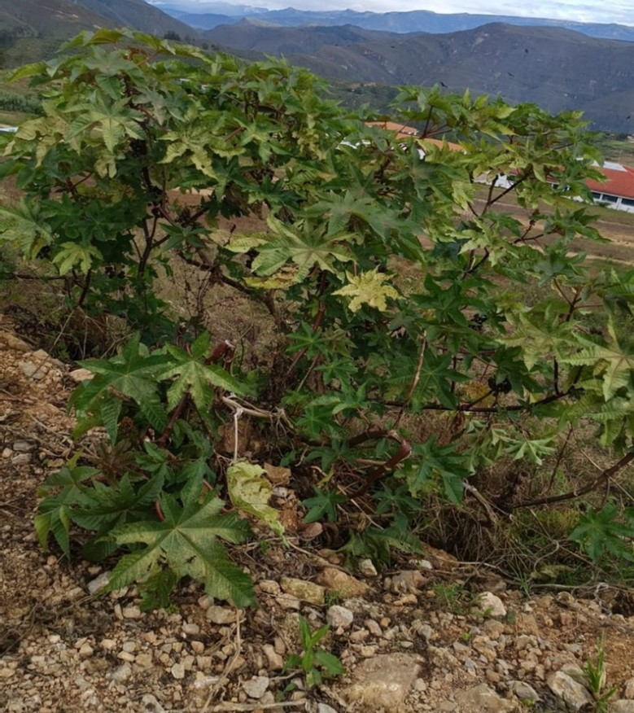
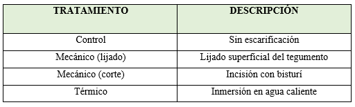
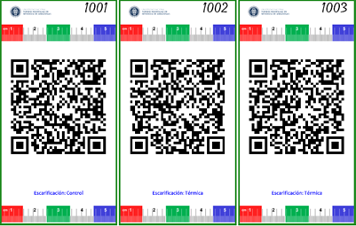
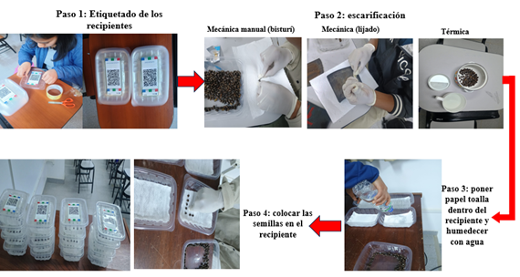

# **II. MATERIALES Y MÉTODOS**

:::::::: {style="font-family:'Times New Roman', serif; font-size:14px; text-align:justify; line-height:1.75;"}

**2.1 Materiales**

**a) Materiales de laboratorio**

- Papel toalla  
- Recipientes plásticos  
- Agua mineral  
- Etiquetas  
- Guantes  
- Pinzas  
- Lijas  
- Bisturí  
- Cinta  
- Agua caliente  

**b) Material biológico**

- Higuerilla (*Ricinus Communis*)

**2.2 Metodología**

**a) Recolección de semillas:**  
Las semillas de higuerilla fueron recolectadas de una plantación ubicada en la carretera hacia Taquia, a espaldas de la UNTRM. Se seleccionaron 400 semillas de higuerilla con apariencia uniforme y sin daños visibles.

::: {style="text-align:center; margin:15px 0;"}
<figure>
  
  <figcaption>Figura 1. Planta de higuerilla (*Ricinus communis*)</figcaption>
</figure>
:::

**b) Tratamientos de escarificación:**

::: {style="text-align:center; margin:15px 0;"}
<figure>
  
  <figcaption>Figura 2. Tabla de tratamientos</figcaption>
</figure>
:::

**c) Elaboración de etiquetas:**  
Para identificar los tratamientos, se generaron etiquetas usando el paquete huito de R, que permite crear etiquetas personalizadas. Previamente se hizo la libreta de campo usando la plataforma Tarpuy, para facilitar el diseño experimental. Los datos de los tratamientos se registraron en una hoja de cálculo de Google Sheets y luego se importaron a R. Durante la elaboración de las etiquetas, se incorporaron algunos datos como el número y logo de la universidad, además del nombre del factor (escarificación).

::: {style="text-align:center; margin:15px 0;"}
<figure>
  
  <figcaption>Figura 3. Etiquetas de identificación</figcaption>
</figure>
:::

**d) Procedimiento:**  
El experimento se llevó a cabo para evaluar la germinación de semillas de higuerilla, bajo tratamientos de escarificación. Se utilizó un diseño completamente al azar (DCA), con 3 tratamiento + control y 4 repeticiones, haciendo un total de 16 unidades experimentales.

**1. Escarificación mecánica (lijado y corte):**  
Se realizó el conteo manual de las semillas, estableciendo 25 semillas por cada tratamiento. Se lijaron 25 semillas quitando superficialmente el tegumento; luego se hizo una pequeña incisión en las siguientes 25 semillas con ayuda de un bisturí. En todo momento se hizo uso de guantes para evitar contaminación.

**2. Escarificación térmica:**  
Para este tratamiento se usa agua caliente. Se colocó 25 semillas dentro de un recipiente contenido de agua caliente, pasado un tiempo prudente se sacaron las semillas y se colocaron sobre papel toalla, para retirar el exceso de humedad.

**3. Control:**  
Para este tratamiento no se realiza escarificación, solo se coloca las 25 semillas en los recipientes.

Las semillas escarificadas fueron distribuidas cuidadosamente sobre el sustrato húmedo, lo que permitió mantener una separación adecuada entre ellas, evitando competencia por agua y espacio, y asegurando condiciones homogéneas para su desarrollo.  
Una vez instaladas las unidades experimentales fueron cerradas para conservar la humedad interna. El ensayo se mantuvo a temperatura ambiente de la ciudad de Chachapoyas (10–25 °C). Durante este tiempo se realizaron observaciones diarias, registrando la aparición de la radícula como indicador de germinación, ubicando los datos en un libro de campo.

:::: {style="text-align:center; margin:15px 0;"}
<figure>
  
  <figcaption>Figura 4. Resumen gráfico</figcaption>
</figure>
:::

::::
:::::::: 