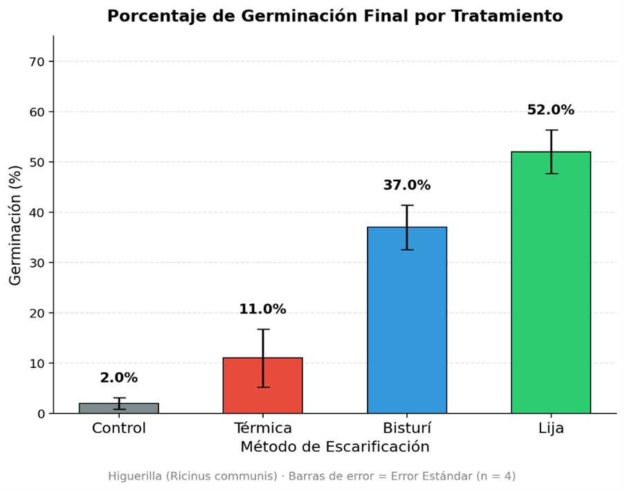
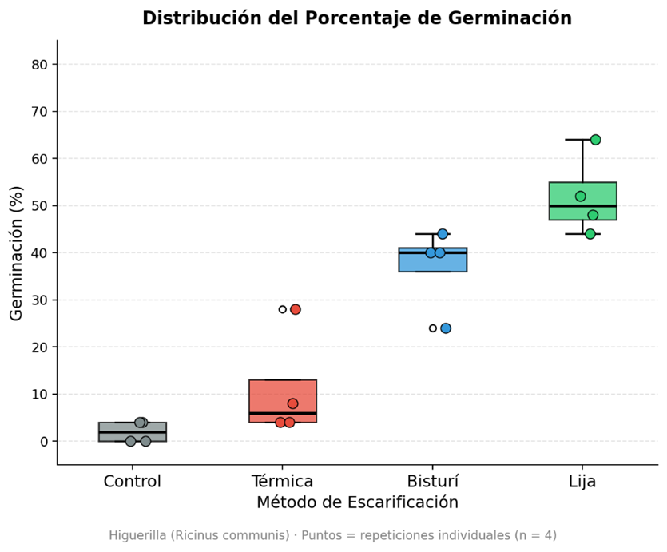
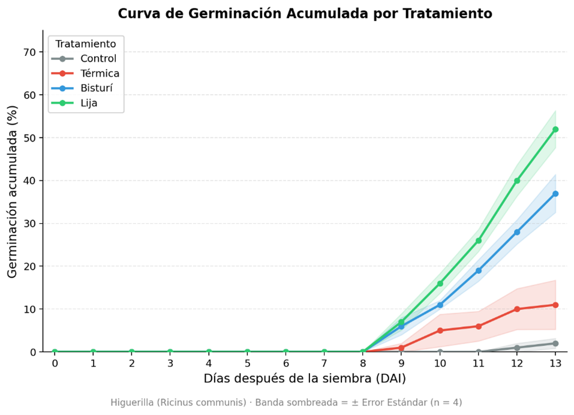
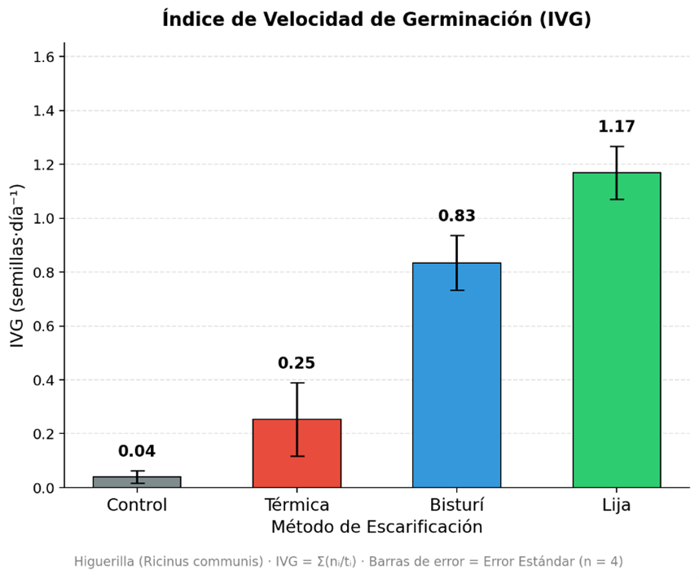

# **III. RESULTADOS**

::::::: {style="font-family:'Times New Roman', serif; font-size:14px; text-align:justify; line-height:1.75;"}
**3.1 Efecto de los métodos de escarificación sobre el porcentaje de germinación**\
Los resultados obtenidos al día 13 después de la siembra (DAI 13) mostraron diferencias notorias entre los tratamientos evaluados (Figura 4). La escarificación mecánica con lija registró el mayor porcentaje de germinación con 52,0 ± 8,6 %, seguida por la escarificación manual con bisturí (37,0 ± 8,9 %), la escarificación térmica (11,0 ± 11,5 %) y el control sin escarificación (2,0 ± 2,3 %).

::: {style="text-align:center; margin:15px 0;"}
{height="auto" style="max-width:75%;"}

<strong>Figura 4. Porcentaje de germinación por tratamiento.</strong>

:::

El tratamiento control presentó una germinación casi nula, con un máximo de 4 % en algunas repeticiones y 0 % en otras, confirmando la presencia de dormancia en las semillas de higuerilla bajo condiciones de laboratorio. La escarificación térmica mostró resultados variables entre repeticiones (rango: 4–28 %).

::: {style="text-align:center; margin:15px 0;"}
{height="auto" style="max-width:75%;"}

<strong>Figura 5. Porcentaje de germinación – Distribución.</strong>

:::

**3.2 Curvas de germinación acumulada**\
El análisis temporal de la germinación acumulada (Figura 6) reveló que todos los tratamientos con escarificación iniciaron su actividad germinativa a partir del DAI 9, mientras que el control prácticamente no presentó germinación a lo largo del período de evaluación. Los tratamientos con lija y bisturí mostraron una progresión sostenida y consistente desde el DAI 9 hasta el DAI 13, mientras que la escarificación térmica presentó un comportamiento irregular e inconsistente entre repeticiones.

::: {style="text-align:center; margin:15px 0;"}
{height="auto" style="max-width:75%;"}

<strong>Figura 6. Curva de germinación acumulada.</strong>

:::

**3.3 Variabilidad entre repeticiones**  
El boxplot comparativo evidenció que los tratamientos mecánicos (lija y bisturí) presentaron mayor consistencia entre repeticiones en comparación con la escarificación térmica. La lija mostró valores entre 44 % y 64 %, el bisturí entre 24 % y 44 %, mientras que la térmica varió entre 4 % y 28 %, indicando una respuesta poco predecible de este último tratamiento.

**3.4 Índice de Velocidad de Germinación (IVG)**\
En cuanto a la velocidad de germinación (Figura 7), la escarificación con lija obtuvo el mayor IVG (1,17 ± 0,20 semillas·día⁻¹), seguida por el bisturí (0,83 ± 0,20 semillas·día⁻¹), la escarificación térmica (0,25 ± 0,27 semillas·día⁻¹) y el control (0,04 ± 0,05 semillas·día⁻¹). Este indicador confirma que no solo la lija logró mayor porcentaje final, sino también una germinación más rápida y uniforme.

::: {style="text-align:center; margin:15px 0;"}
{height="auto" style="max-width:75%;"}

<strong>Figura 7. Velocidad de germinación.</strong>

:::
:::::::